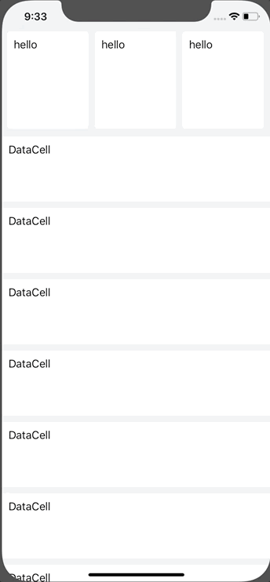

# programatticCollectionViews

Implementation of 2 collection views created programmatically (no storyboard). The top collection is horizontal, the bottom is vertical.

The views use auto-layout constraints for placement.

